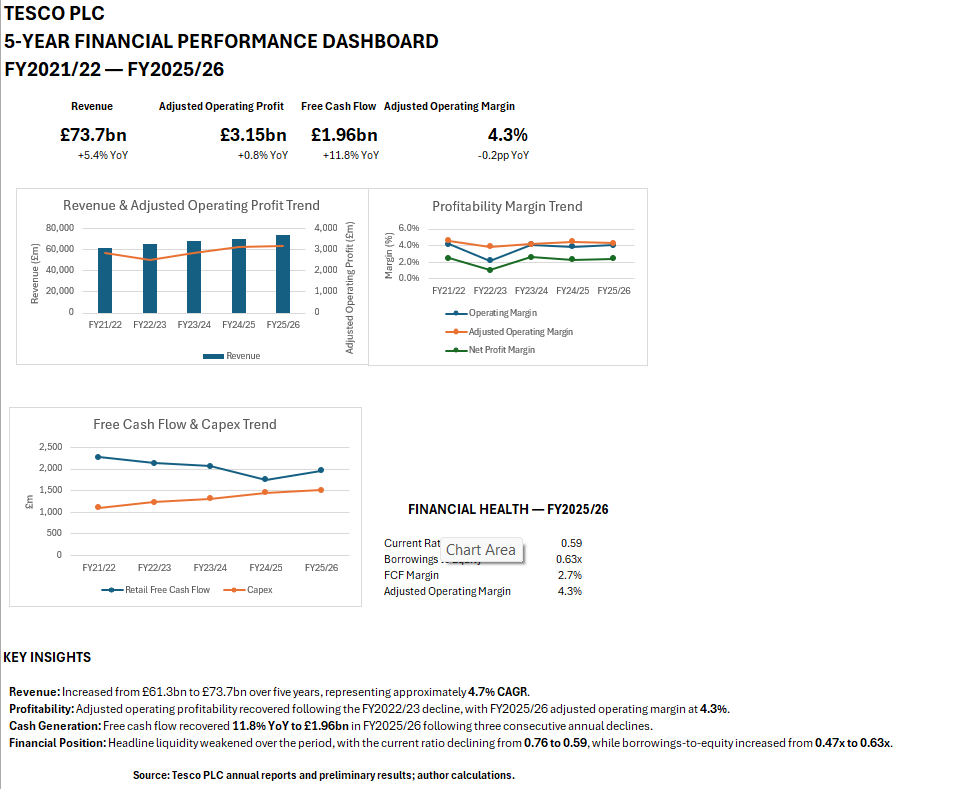

# Tesco PLC — Five-Year Financial Performance Analysis

## Project Overview

This project analyses Tesco PLC's financial performance across FY2021/22 to FY2025/26 using Microsoft Excel.

The analysis evaluates revenue growth, profitability, liquidity, leverage, capital investment and free cash flow, with the aim of translating financial statement data into clear business insights.

## Dashboard Preview

## Objectives

The project was designed to:

- Analyse Tesco's five-year revenue and profitability trends
- Evaluate liquidity and financial position
- Assess leverage and capital structure
- Analyse free cash flow and capital expenditure
- Calculate key financial ratios
- Build an executive financial dashboard
- Translate financial data into analyst-style conclusions

## Tools Used

- Microsoft Excel
- Financial Statement Analysis
- Ratio Analysis
- Financial Modelling
- Data Visualisation

## Workbook Structure

The Excel workbook contains seven worksheets:

1. `01_Raw_Data` — Five-year financial statement data
2. `02_Performance` — Revenue, profit, margins and growth analysis
3. `03_Balance_Sheet` — Liquidity, leverage and financial position
4. `04_Cash_Flow` — Free cash flow and capital investment analysis
5. `05_Ratios` — Financial health and ratio summary
6. `06_Dashboard` — Executive financial dashboard
7. `07_Key_Findings` — Key findings and analyst conclusion

## Key Findings

### Revenue Growth

Tesco's statutory revenue increased from approximately £61.3bn in FY2021/22 to £73.7bn in FY2025/26, representing approximately 4.7% compound annual growth.

### Profitability

Adjusted operating profit recovered following a significant decline in FY2022/23 and reached approximately £3.15bn in FY2025/26.

Adjusted operating margin recovered from 3.8% in FY2022/23 to 4.3% in FY2025/26.

### Cash Generation

Tesco generated positive retail free cash flow throughout the period.

Free cash flow declined through FY2024/25 before recovering by approximately 11.8% year-on-year to £1.96bn in FY2025/26.

### Liquidity

The current ratio declined from approximately 0.75x in FY2021/22 to 0.59x in FY2025/26.

This should be interpreted in the context of Tesco's grocery retail working-capital model and structural balance-sheet changes during the period.

### Capital Structure

Total borrowings remained relatively stable over the five years, while borrowings-to-equity increased from approximately 0.47x to 0.63x, partly reflecting a reduction in reported equity.

### Capital Investment

Capex increased from approximately £1.10bn in FY2021/22 to £1.51bn in FY2025/26, indicating continued investment in the business.

## Analyst Conclusion

Tesco's five-year financial performance demonstrates resilience, with consistent revenue growth, recovered underlying profitability and positive free cash flow throughout the period.

However, the analysis also highlights areas requiring continued monitoring, including liquidity, leverage and free cash flow relative to operating profitability.

Overall, Tesco entered FY2025/26 with stronger revenue, adjusted operating profit and free cash flow than the preceding year, while maintaining significant investment in the business.

## Methodology Notes

- FY2022/23 figures use restated continuing-operations comparatives where applicable.
- FY2021/22 and FY2022/23 balance-sheet figures reflect Tesco's subsequently restated comparatives following the adoption of IFRS 17.
- FY2025/26 statutory measures reflect a 53-week reporting period, while selected alternative performance measures are presented on Tesco's comparable 52-week basis.
- Current assets and current liabilities include amounts classified as held for sale where applicable.
- Total borrowings excludes lease liabilities and should not be interpreted as total debt.

## Data Sources

Financial data was obtained from Tesco PLC annual reports and preliminary results.

All calculations, ratios, charts and interpretations were prepared independently for this portfolio project.

## Disclaimer

This project is intended for educational and portfolio purposes only and does not constitute investment advice.
